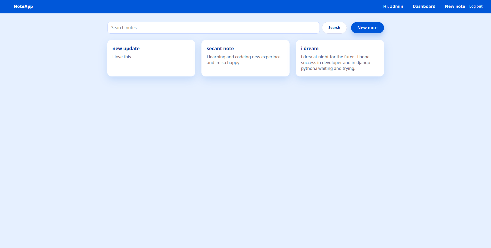

# NoteApp

Personal note board built with Django 6.0. The app focuses on a resume-ready feature set: authenticated CRUD, polished UI, search, pagination, and a clean developer experience.

## Features
- Secure notes: every list/detail/update/delete view is scoped to the logged-in user and protected with `login_required`.
- Search & pagination: filter notes by title/content using the `?q=` query param and browse paginated results (10 notes per page).
- Flash messages: success/error toasts after create/update/delete to guide the user journey.
- Modern UI: shared `base.html`, responsive layout, button styles, and consistent English copy across templates.
- Friendly errors: invalid forms re-render with inline validation messages.

## Tech Stack
- Python 3.13 / Django 6.0
- SQLite (default dev database)
- Poetry for dependency management

## Getting Started
1. **Clone & install**
   ```bash
   git clone <your-fork-url> noteapp
   cd noteapp
   poetry install
   ```
2. **Apply migrations**
   ```bash
   poetry run python manage.py migrate
   ```
3. **Create a superuser**
   ```bash
   poetry run python manage.py createsuperuser
   ```
4. **Run the dev server**
   ```bash
   poetry run python manage.py runserver
   ```
5. **Log in** via `/accounts/login/`, then create/read/update/delete notes from the dashboard.

## Running Tests
```bash
poetry run python manage.py test
```

## Project Highlights
- `notes/views.py`: encapsulates all CRUD logic, search, pagination, and message handling.
- `notes/templates/base.html`: global layout, navigation, and styling foundation.
- `notes/tests.py`: regression tests covering authorization boundaries, search, validation, and delete logic.

## Screenshots
Add screenshots (e.g., `docs/dashboard.png`, `docs/detail.png`) to showcase the UI on GitHub. Reference them here once captured:
```markdown

```

## Deployment Notes
- Update `ALLOWED_HOSTS` and configure a production-ready database before deploying.
- Serve static files via WhiteNoise or a CDN in production.
